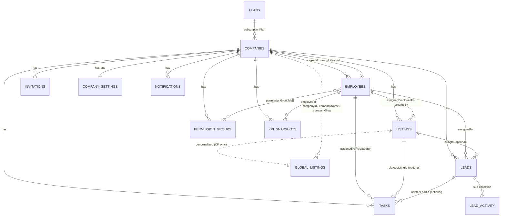

# Data Model — Real Estate SaaS (Firestore)

> **Database:** Google **Cloud Firestore** (NoSQL, document-oriented) — **not** SQL Server.
> There are no tables or foreign keys; "relationships" are document-ID references and
> denormalized copies enforced in application code + Security Rules + Cloud Functions.
> **Multi-tenant model:** one Firestore database, tenant isolation by document **path**
> (`companies/{companyId}/…`) plus `companyId` custom claims on each user.

Generated from the source of truth: `src/types/*`, `firestore.rules`, `firestore.indexes.json`,
`src/constants/*`.

---

## 1. Collection Map (hierarchy)

```
(root)
├── companies/{companyId}                      ← tenant root (public profile)
│   ├── settings/{settingsId}                  ← branding, automation config
│   ├── employees/{uid}                        ← internal users (id == Auth uid)
│   ├── invitations/{invitationId}             ← employee invite workflow
│   ├── permission_groups/{groupId}            ← reusable permission bundles
│   ├── listings/{listingId}                   ← property inventory
│   ├── leads/{leadId}                         ← CRM leads
│   │   └── activity/{activityId}              ← per-lead audit trail (sub-collection)
│   ├── tasks/{taskId}                         ← internal tasks
│   ├── kpi/{period}                           ← live company KPI overview (CF-written)
│   ├── kpi_snapshots/{period_employeeId}      ← per-employee monthly KPI (CF-written)
│   ├── activity_logs/{logId}                  ← company audit log (CF-written)
│   └── notifications/{notifId}                ← in-app notifications
│
├── global_listings/{listingId}               ← denormalized public marketplace (CF-synced)
├── platform_admins/{uid}                      ← super-admin registry
├── invitations/{invId}                        ← root mirror for invite lookup
├── plans/{planId}                             ← subscription catalog (public)
└── audit_logs/{logId}                         ← platform-level audit (super-admin)
```

`{...}` = document ID. Cloud-Function-written (`CF`) collections are read-only to clients.

---

## 2. Entity-Relationship Diagram (ERD)

Relationships are by stored ID (no DB-enforced FKs). `→` = "references"; `⇒` = "denormalized copy of".



### Relationship cheat-sheet (the key joins your analyst will want)

| From | Field | → To | Notes |
|------|-------|------|-------|
| `employees.id` | == | Firebase **Auth uid** | Employee doc ID *is* the auth uid |
| `companies.ownerId` | → | `employees.id` | The company owner |
| `listings.createdBy` | → | `employees.id` | Who created the listing |
| `listings.assignedEmployeeId` | → | `employees.id` | Listing agent (nullable) |
| `leads.assignedTo` | → | `employees.id` | Lead owner (nullable) |
| `leads.listingId` | → | `companies/{cid}/listings.id` | Source property (nullable) |
| `tasks.assignedTo` | → | `employees.id` | Task owner |
| `tasks.createdBy` | → | `employees.id` | Task creator |
| `tasks.relatedListingId` | → | `listings.id` | Optional link |
| `tasks.relatedLeadId` | → | `leads.id` | Optional link |
| `employees.permissionGroupIds[]` | → | `permission_groups.id` | Many-to-many |
| `kpi_snapshots.employeeId` | → | `employees.id` | Monthly per-agent metrics |
| `invitations.invitedBy` | → | `employees.id` | Inviter |
| `global_listings.id` | == | `companies/{cid}/listings.id` | Same ID, denormalized copy |
| `global_listings.companyId` | → | `companies.id` | Marketplace owner |
| `notifications.recipientId` | → | `employees.id` | In-app notification target |
| `lead_activity.actorId` | → | `employees.id` | Who performed the action |

> **Denormalization note:** `*_Name` fields (`assignedToName`, `assignedEmployeeName`,
> `companyName`, `listingTitle`, etc.) and counters (`listingsCount`, `activeEmployeesCount`)
> are **stored copies** kept in sync by app code / Cloud Functions — they may lag the source.
> Treat the ID fields as authoritative for joins.

---

## 3. Data Dictionary

Legend — Type: `str`, `num`, `bool`, `ts` (timestamp), `map` (nested object), `arr`. **PII** flags sensitive fields.

### companies/{companyId}
| Field | Type | Notes |
|-------|------|-------|
| id | str | == document ID |
| name / nameAr | str | display name (+ Arabic) |
| slug | str | **unique**, URL-safe (`/c/{slug}`) |
| description / descriptionAr | str? | |
| logo | str? | logo URL |
| theme | map | `{primaryColor, secondaryColor, accentColor?, fontFamily?, logoUrl?, heroImageUrl?, darkMode?}` |
| subscriptionPlan | str enum | → plans (`free`/`starter`/`pro`/`enterprise`) |
| ownerId | str | → employees.id (company_owner) |
| status | str enum | `active` / `suspended` / `trial` / `cancelled` |
| contact | map | phone, whatsapp, email, address, city, country, mapUrl, website, socials{…} — **PII (business)** |
| supportedLanguages | arr | subset of `["en","ar"]` |
| defaultLanguage | str | `en` / `ar` |
| listingsCount | num | denormalized counter |
| activeEmployeesCount | num | denormalized counter |
| trialEndsAt | ts? | |
| createdAt / updatedAt | ts | |

### companies/{cid}/settings/{settingsId}
| Field | Type | Notes |
|-------|------|-------|
| id, companyId | str | |
| leadAutoAssign | bool | enables round-robin auto-assignment |
| leadAutoAssignStrategy | str enum | `round_robin` / `least_busy` / `manual` |
| taskEscalationHours | num | overdue threshold (hrs) for escalation |
| whatsappCtaNumber | str? | |
| notificationEmails | arr<str> | escalation/notice recipients |
| integrations | map | `{googleAnalyticsId?, metaPixelId?, recaptchaSiteKey?}` |
| updatedAt | ts | |

### companies/{cid}/employees/{uid}
| Field | Type | Notes |
|-------|------|-------|
| id | str | **== Firebase Auth uid** |
| companyId | str | → companies.id |
| email | str | **PII** |
| name | str | **PII** |
| phone | str? | **PII** |
| avatar | str? | |
| role | str enum | see Roles below |
| permissions | arr<str> | effective permissions (role defaults + overrides) |
| permissionGroupIds | arr<str>? | → permission_groups.id (M:N) |
| active | bool | soft-delete flag |
| department / title | str? | |
| kpi | map | `EmployeeKPIMetrics` (listingsCreated, leadsAssigned, dealsClosed, avgResponseMinutes, …) |
| invitedBy | str? | → employees.id |
| invitedAt / joinedAt / lastActiveAt | ts? | |
| createdAt / updatedAt | ts | |

### companies/{cid}/invitations/{invitationId}
| Field | Type | Notes |
|-------|------|-------|
| id, companyId | str | |
| email | str | **PII** |
| role | str enum | role to grant on accept |
| permissions | arr<str>? | optional overrides |
| invitedBy | str | → employees.id |
| token | str | **one-time secret** — exclude from any export |
| status | str enum | `pending` / `accepted` / `expired` / `revoked` |
| expiresAt / createdAt | ts | |

### companies/{cid}/permission_groups/{groupId}
| Field | Type | Notes |
|-------|------|-------|
| id, companyId | str | |
| nameEn / nameAr | str | |
| permissions | arr<str> | bundle of Permission codes |
| active | bool | |
| createdBy | str | → employees.id |
| createdAt / updatedAt | ts | |

### companies/{cid}/listings/{listingId}
| Field | Type | Notes |
|-------|------|-------|
| id, companyId | str | |
| title / titleAr / description / descriptionAr | str | |
| type | str enum | `rent` / `sale` / `off_plan` |
| category | str enum | `apartment`/`villa`/`land`/`commercial`/`building`/`office`/`warehouse`/`townhouse`/`penthouse`/`studio` |
| price | num | |
| currency | str | ISO 4217 (default `SAR`) |
| priceNegotiable | bool? | |
| rentPeriod | str enum? | `monthly`/`yearly`/`daily` |
| location | map | `{country, city, district?, address?, lat?, lng?, geohash?}` |
| bedrooms / bathrooms | num? | |
| area | num | |
| areaUnit | str enum | `sqm` / `sqft` |
| yearBuilt / floorNumber / totalFloors | num? | |
| amenities | map | parking, furnished, pool, gym, … (bool/num) |
| media | arr<map> | `{url, path, type(image/video), order, isCover?, …}` |
| coverImage | str? | denormalized first image |
| assignedEmployeeId | str? | → employees.id |
| assignedEmployeeName | str? | denormalized |
| status | str enum | `draft`/`published`/`pending_review`/`sold`/`rented`/`archived` |
| featured | bool | |
| publishedAt | ts? | |
| analytics | map | views, uniqueViews, inquiries, whatsappClicks, phoneClicks, favorites |
| createdBy | str | → employees.id |
| createdAt / updatedAt | ts | |

### companies/{cid}/leads/{leadId}
| Field | Type | Notes |
|-------|------|-------|
| id, companyId | str | |
| name | str | **PII** |
| phone | str | **PII** |
| email | str? | **PII** |
| nationalId | str? | **PII (sensitive)** — 10 digits; masked in UI by permission |
| message | str? | |
| preferredContactMethod | str enum? | `phone`/`whatsapp`/`email` |
| listingId | str? | → listings.id |
| listingTitle | str? | denormalized |
| source | str enum | `website_form`/`whatsapp`/`phone`/`walk_in`/`social_media`/`referral`/`marketplace`/`other` |
| assignedTo | str? | → employees.id |
| assignedToName | str? | denormalized |
| assignedAt | ts? | |
| status | str enum | `new`/`contacted`/`qualified`/`deal`/`lost` |
| firstResponseAt | ts? | |
| responseTimeMinutes | num? | computed |
| notes | arr<map>? | embedded `{id, authorId, authorName, text, createdAt}` |
| tags | arr<str>? | |
| utm | map? | source/medium/campaign/term/content |
| createdAt / updatedAt | ts | |

### companies/{cid}/leads/{leadId}/activity/{activityId}  *(sub-collection)*
| Field | Type | Notes |
|-------|------|-------|
| companyId, leadId | str | |
| type | str | e.g. `lead_created` |
| actorId | str | → employees.id |
| actorName | str | denormalized |
| message | str | |
| metadata | map? | `{source, listingId, assignedTo, …}` |
| createdAt | ts | |

### companies/{cid}/tasks/{taskId}
| Field | Type | Notes |
|-------|------|-------|
| id, companyId | str | |
| title / description | str | |
| assignedTo | str | → employees.id |
| assignedToName | str? | denormalized |
| createdBy | str | → employees.id |
| createdByName | str? | |
| priority | str enum | `low`/`medium`/`high`/`urgent` |
| status | str enum | `todo`/`in_progress`/`done`/`cancelled` |
| dueDate | ts | |
| completedAt | ts? | |
| escalated | bool | |
| escalatedAt | ts? | |
| escalatedTo | str? | → employees.id (manager) |
| relatedListingId | str? | → listings.id |
| relatedLeadId | str? | → leads.id |
| tags | arr<str>? | |
| createdAt / updatedAt | ts | |

### companies/{cid}/kpi_snapshots/{period_employeeId}  *(Cloud-Function written)*
| Field | Type | Notes |
|-------|------|-------|
| id | str | doc id = `{YYYY-MM}_{employeeId}` |
| companyId, employeeId, employeeName | str | employeeId → employees.id |
| period | str | `YYYY-MM` |
| listingsCreated, listingsActive, leadsAssigned, leadsConverted, dealsClosed, callsMade, tasksCompleted, tasksOverdue | num | |
| conversionRate | num | 0–1 |
| revenueGenerated, avgResponseMinutes | num | |
| rank / score | num? | |
| createdAt | ts | |

### companies/{cid}/kpi/{period}  *(Cloud-Function written — CompanyKPIOverview)*
| Field | Type | Notes |
|-------|------|-------|
| companyId, period | str | |
| totalListings, activeListings, totalLeads, newLeadsThisMonth, convertedLeads, totalRevenue, totalEmployees, avgResponseMinutes | num | |
| topPerformerId | str? | → employees.id |
| topPerformerName | str? | |
| updatedAt | ts | |

### companies/{cid}/notifications/{notifId}  *(read-only to clients)*
| Field | Type | Notes |
|-------|------|-------|
| companyId | str | |
| recipientId | str | → employees.id |
| type | str | e.g. `lead_assigned` |
| title / message | str | |
| leadId | str? | → leads.id |
| read | bool | |
| actorId / actorName | str | |
| createdAt / updatedAt | ts | |

### global_listings/{listingId}  *(denormalized public marketplace — CF-synced from listings)*
| Field | Type | Notes |
|-------|------|-------|
| id | str | == source listing id |
| companyId / companyName / companySlug / companyLogo | str | denormalized from companies |
| title / titleAr | str | |
| type / category | str enum | as listings |
| price / currency | num/str | |
| city / country / district | str | |
| bedrooms / bathrooms / area / areaUnit | num/str | |
| coverImage | str? | |
| status | str | always `published` |
| featured | bool | |
| createdAt / updatedAt | ts | |

### platform_admins/{uid}, plans/{planId}, audit_logs/{logId}
| Collection | Key fields |
|------------|-----------|
| platform_admins | `{ email, createdAt }` — registry of super admins (uid = Auth uid) |
| plans | subscription catalog (public read); referenced by `companies.subscriptionPlan` |
| audit_logs | platform-level audit trail (super-admin only) |

---

## 4. Enumerations

| Enum | Values |
|------|--------|
| **Roles** | `super_admin`, `company_owner`, `company_admin`, `manager`, `sales`, `marketing`, `data_entry`, `accountant`, `viewer` |
| **CompanyStatus** | `active`, `suspended`, `trial`, `cancelled` |
| **SubscriptionPlan** | `free`, `starter`, `pro`, `enterprise` |
| **ListingType** | `rent`, `sale`, `off_plan` |
| **ListingCategory** | `apartment`, `villa`, `land`, `commercial`, `building`, `office`, `warehouse`, `townhouse`, `penthouse`, `studio` |
| **ListingStatus** | `draft`, `published`, `pending_review`, `sold`, `rented`, `archived` |
| **LeadSource** | `website_form`, `whatsapp`, `phone`, `walk_in`, `social_media`, `referral`, `marketplace`, `other` |
| **LeadStatus** | `new`, `contacted`, `qualified`, `deal`, `lost` |
| **TaskPriority** | `low`, `medium`, `high`, `urgent` |
| **TaskStatus** | `todo`, `in_progress`, `done`, `cancelled` |

---

## 5. Composite Indexes (existing query patterns)

These reveal how the app actually queries the data (from `firestore.indexes.json`):

| Collection | Indexed fields (in order) | Supports |
|------------|---------------------------|----------|
| listings | status ↑, featured ↓, createdAt ↓ | inventory list, featured-first |
| listings | type ↑, category ↑, price ↑ | filtered search by type/category/price |
| listings | assignedEmployeeId ↑, status ↑, updatedAt ↓ | "my listings" per agent |
| leads | status ↑, assignedTo ↑, createdAt ↓ | pipeline by status + owner |
| leads | assignedTo ↑, createdAt ↓ | "my leads" feed |
| tasks | assignedTo ↑, status ↑, dueDate ↑ | task board per agent |
| tasks | escalated ↑, dueDate ↑ | escalation scheduler |
| global_listings | city ↑, type ↑, price ↑ | marketplace search |
| global_listings | featured ↓, createdAt ↓ | marketplace homepage |
| global_listings | companyId ↑, status ↑, createdAt ↓ | company public page |

`listings.status` also has single-field overrides incl. **collection-group** scope (query listings across all tenants).

---

## 6. Notes for the analyst

- **No relational dump exists.** To query this like SQL, the recommended path is the
  **Firestore → BigQuery** export (managed export or the BigQuery export extension); then
  every collection becomes a BigQuery table you can `JOIN` on the ID fields in §2.
- **IDs over names for joins.** Join on `*Id` fields; the `*Name` mirrors can be stale.
- **Sub-collections** (`leads/{id}/activity`) need a **collection-group** query/export to flatten.
- **PII to exclude/mask** before any non-prod use: `leads.nationalId`, `leads.phone`,
  `leads.email`, `leads.name`, `employees.email/phone/name`, `invitations.token`,
  `companies.contact.*`.
```
